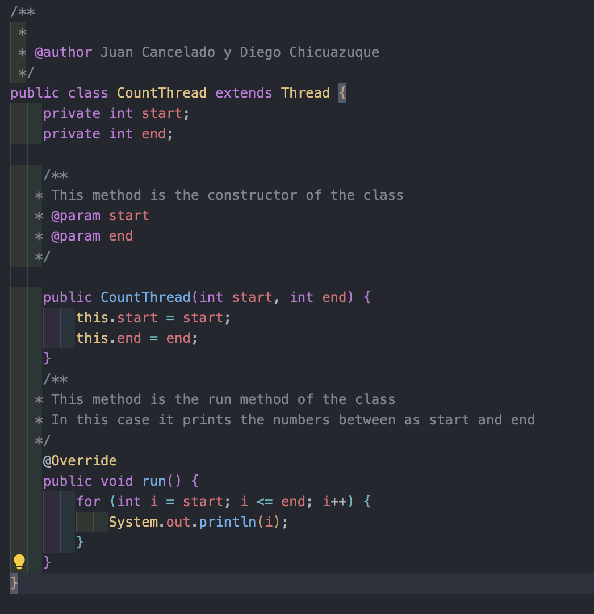
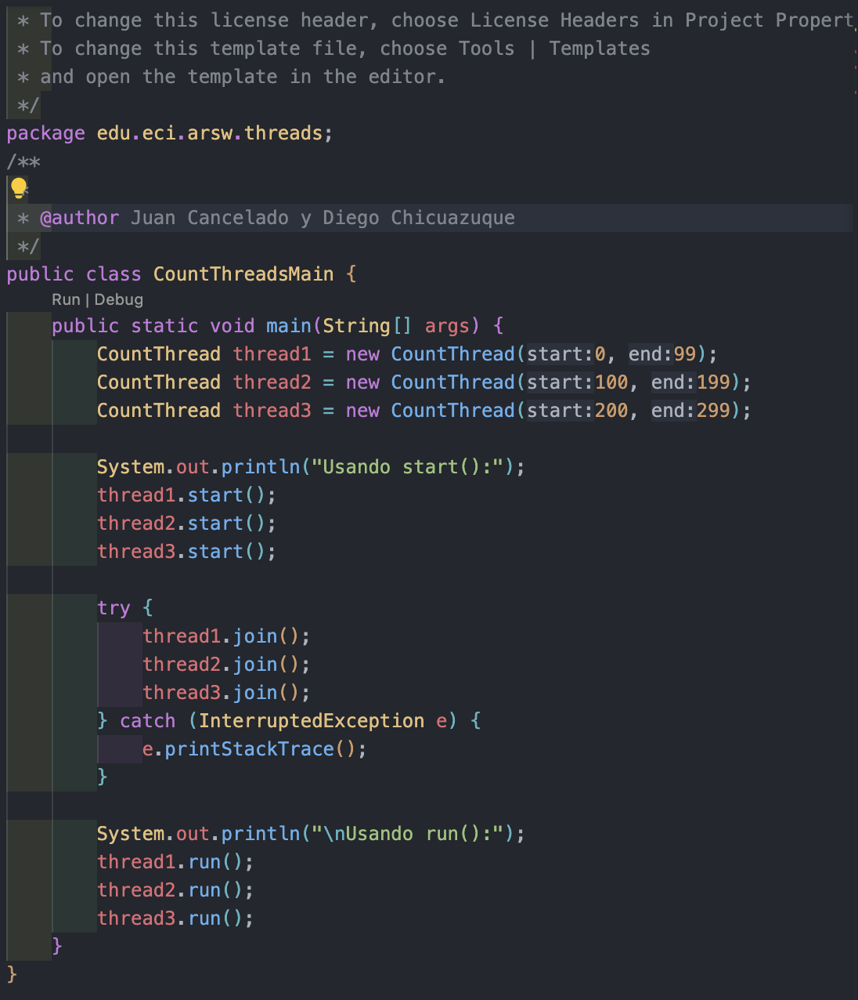

## Arquitecturas de Software Laboratorio 1
### Introducción al paralelismo - hilos
### Integrantes: Juan Cancelado y Diego Chicuazuque
**Parte I Hilos Java**

## parte 3 
### usando visual vm y calculando 100.000 digitos de phi

#### Nota: se uso 100.000 debido a que durante las pruebas con 1.000.000 duraron mas de 1 hr sin completarse la de 1 hilo por lo que se opto por reducir el numero de digitos

Experimentando: Un solo hilo
Tiempo de ejecución con 1 hilos: 180630 ms

Experimentando: Con 12 hilos (núcleos)
Tiempo de ejecución con 12 hilos: 34929 ms

Experimentando: Con 24 hilos
Tiempo de ejecución con 24 hilos: 24989 ms

Experimentando: Con 200 hilos
Tiempo de ejecución con 200 hilos: 21667 ms

Experimentando: Con 500 hilos
Tiempo de ejecución con 500 hilos: 21456 ms

