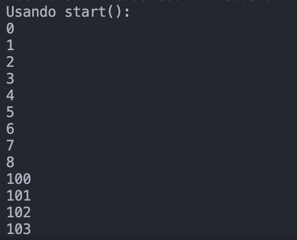
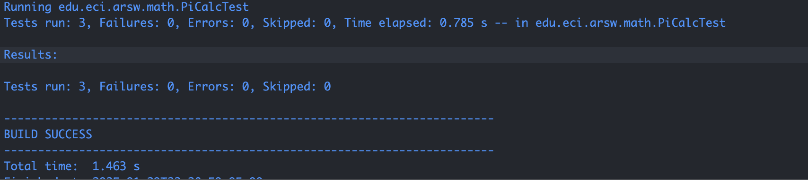

## Arquitecturas de Software Laboratorio 1
### Introducción al paralelismo - hilos
### Integrantes: Juan Cancelado y Diego Chicuazuque
## parte 1 

En la primera parte nos piden hacer el ejercicio de ejecutar el codigo con star() el cual va haciendo saltos entre los hilos como podemos observar el hilo 1 va de 0 a 99 pero empieza a saltar por ejemplo de 8 a 100.
,
En la segunda parte nos piden que lo corramos con run() el cual lo que hace es ejecutar cada hilo en orden, entonces este empieza en 0 y cuando llegue a 99 empieza el hilo 2.
,
Cambie el incio con 'start()' por 'run()'. Cómo cambia la salida?, por qué?.

La salida cambia porque el start() lo que hace es ejecutar todos los hilos al tiempo entonces como es al tiempo va imprimiendo lo primero que salga.
Por el otro lado como podemos ver con run() ejecuta los hilos uno por uno.
## parte 2

Lo que hicimos en este punto fue hacer un thread el cual calcula los digitos de pi en base 16 e intentamos consguir muchos digitos de este tambien nos piden las pruebas con 3 hilos.

,

## parte 3 
### usando visual vm y calculando 100.000 digitos de phi

#### Nota: se uso 100.000 debido a que durante las pruebas con 1.000.000 duraron mas de 1 hr sin completarse la de 1 hilo por lo que se opto por reducir el numero de digitos

Experimentando: Un solo hilo
Tiempo de ejecución con 1 hilos: 180630 ms

Experimentando: Con 12 hilos (núcleos)
Tiempo de ejecución con 12 hilos: 34929 ms

Experimentando: Con 24 hilos
Tiempo de ejecución con *24 hilos*: *24989 ms*

Experimentando: Con 200 hilos
Tiempo de ejecución con 200 hilos: 21667 ms

Experimentando: Con 500 hilos
Tiempo de ejecución con 500 hilos: 21456 ms

## Preguntas finales

1. Según la [ley de Amdahls](https://www.pugetsystems.com/labs/articles/Estimating-CPU-Performance-using-Amdahls-Law-619/#WhatisAmdahlsLaw?):

	,

      donde _S(n)_ es el mejoramiento teórico del desempeño, _P_ la fracción paralelizable del algoritmo, y _n_ el número de hilos, a mayor _n_, mayor debería ser dicha mejora. Por qué el mejor desempeño no se logra con los 500 hilos?, cómo se     compara este   desempeño cuando se usan 200?.

      Segun esta ley, se ve que a medida que la cantidad e hilos fue aumentando, el tiempo de ejecucion fue disminuyendo considerablemente al comienzo. Pero luego de llegar a los 200 hilos donde se alcanzo un tiempo de 21557 ms el cambio fue menor con respecto a         500 hilos, todo esto concordando con lo que dice esta ley pues el desempeño es cada vez menor a medida que se aumenta la cantidad de hilos

3. Cómo se comporta la solución usando tantos hilos de procesamiento como núcleos comparado con el resultado de usar el doble de éste?.

      Cuando se usaron 12 hilos, que coinciden con el número de núcleos, el sistema puede aprovechar al máximo los núcleos disponibles para realizar tareas paralelas. Sin embargo, cuando se aumentó a 24 hilos, hay más hilos de los que núcleos físicos, lo que             significa que el   sistema tendrá que hacer más conmutación de contexto y compartir recursos entre los hilos, lo que puede causar una disminución de la eficiencia. El beneficio marginal de pasar de 12 a 24 hilos es menor en comparación con el aumento de 1 a        12 hilos.

5. De acuerdo con lo anterior, si para este problema en lugar de 500 hilos en una sola CPU se pudiera usar 1 hilo en cada una de 500 máquinas hipotéticas, la ley de Amdahls se aplicaría mejor?.Si en lugar de esto se usaran c hilos en 500/c máquinas distribuidas (siendo c es el número de núcleos de dichas máquinas), se mejoraría?. Explique su respuesta.

      Usar \( c \) hilos por máquina en **500/c máquinas** también podría mejorar, dependiendo del valor de \( c \). Si \( c \) es el número de núcleos en las máquinas, entonces la cantidad de hilos por máquina se ajustaría a la capacidad de cada máquina, lo que         podría hacer un mejor uso de los recursos. Sin embargo, si la sobrecarga de comunicación entre máquinas es alta o si hay más hilos que núcleos disponibles en una máquina, el desempeño podría no mejorar mucho o incluso empeorar. Es decir entrari a jugar factores como la conexion entre maquinas el modelo de estas y demas factorez relacionados con la conexion entre estas.

- Para **500 hilos en una sola CPU**, la ley de Amdahl muestra que la mejora en el desempeño se ve limitada por la parte secuencial del algoritmo.
- Usar **tantos hilos como núcleos** (12 hilos en este caso) probablemente sea más eficiente que usar el **doble de hilos** (24 hilos).
- Distribuir la carga en **500 máquinas** podría ser ventajoso si la fracción paralelizable es grande y la latencia de comunicación es baja.
      
